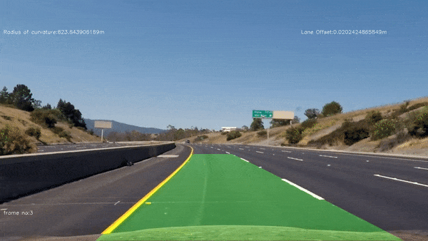

### Advanced Lane Finding Project

The goals / steps of this project are the following:

* Compute the camera calibration matrix and distortion coefficients given a set of chessboard images.
* Apply a distortion correction to raw images.
* Use color transforms, gradients, etc., to create a thresholded binary image.
* Apply a perspective transform to rectify binary image ("birds-eye view").
* Detect lane pixels and fit to find the lane boundary.
* Determine the curvature of the lane and vehicle position with respect to center.
* Warp the detected lane boundaries back onto the original image.
* Output visual display of the lane boundaries and numerical estimation of lane curvature and vehicle position.

[//]: # (Image References)

[image1]: ./examples/undistort_output.png "Undistorted"
[image2]: ./test_images/test1.jpg "Road Transformed"
[image3]: ./examples/binary_combo_example.jpg "Binary Example"
[image4]: ./examples/warped_straight_lines.jpg "Warp Example"
[image5]: ./examples/color_fit_lines.jpg "Fit Visual"
[image6]: ./examples/example_output.jpg "Output"
[image7]: ./examples/undst.jpg
[image8]: ./examples/result.jpg

[video1]: ./final_video.mp4 "Video"


### Camera Calibration


The code for this step is contained in the first code cell of the IPython notebook called `lanedetection.ipynb`.  

I start by preparing "object points", which will be the (x, y, z) coordinates of the chessboard corners in the world. Here I am assuming the chessboard is fixed on the (x, y) plane at z=0, such that the object points are the same for each calibration image.  Thus, `objp` is just a replicated array of coordinates, and `objpoints` will be appended with a copy of it every time I successfully detect all chessboard corners in a test image.  `imgpoints` will be appended with the (x, y) pixel position of each of the corners in the image plane with each successful chessboard detection.  

I then used the output `objpoints` and `imgpoints` to compute the camera calibration and distortion coefficients using the `cv2.calibrateCamera()` function.  I applied this distortion correction to the test image using the `cv2.undistort()` function and obtained this result: 

![alt text][image1]

### Pipeline (single images)

#### 1. Distortion-corrected image.

To demonstrate this step, I will describe how I apply the distortion correction to one of the test images like this one:
![alt text][image2]
![alt text][image7]


#### 2. Color transforms, gradients or other methods to create a thresholded binary image.  

I used a combination of color ,gradient and directional thresholds to generate a binary image (thresholding steps at `lane detection pipeline` in `lanedetection.ipynb file`).  Here's an example of my output for this step.
![alt text][image3]

#### 3. Perspective transform and provide an example of a transformed image.

The code for my perspective transform appears under the heading `Perstective transform to bird's eye view` in the file `lanedetection.ipynb file` (output_images/examples/example.py) (or, for example, in the 14th code cell of the IPython notebook).  The cell takes as inputs an image (`img`), as well as source (`src`) and destination (`dst`) points.  I chose to hardcode the source and destination points in the following manner:

```python
src = np.float32(
    [[(img_size[0] / 2) - 55, img_size[1] / 2 + 100],
    [((img_size[0] / 6) - 10), img_size[1]],
    [(img_size[0] * 5 / 6) + 60, img_size[1]],
    [(img_size[0] / 2 + 55), img_size[1] / 2 + 100]])
dst = np.float32(
    [[(img_size[0] / 4), 0],
    [(img_size[0] / 4), img_size[1]],
    [(img_size[0] * 3 / 4), img_size[1]],
    [(img_size[0] * 3 / 4), 0]])
```

This resulted in the following source and destination points:

| Source        | Destination   | 
|:-------------:|:-------------:| 
| 585, 460      | 320, 0        | 
| 203, 720      | 320, 720      |
| 1127, 720     | 960, 720      |
| 695, 460      | 960, 0        |

I verified that my perspective transform was working as expected by drawing the `src` and `dst` points onto a test image and its warped counterpart to verify that the lines appear parallel in the warped image.

![alt text][image4]

#### 4. Lane-line pixels and fit their positions with a polynomial?

I used the sliding window approach to detect the lane pixels in the current image frame then fit my lane lines with a 2nd order polynomial kinda like this:

![alt text][image5]

#### 5. The radius of curvature of the lane and the position of the vehicle with respect to center.

I did this in the cell 13 under `Image pipeline` in my code in `lanedetection.ipynb file`. I used the radius of curvature equation and scaled it to real world coordinate by multiplying it with pixel to meter ratio.

#### 6. Results


[](https://youtu.be/YnfnWrZ8H4k)


## Dependencies

[1] OpenCV\
[2] Numpy \
[3] Movie.py


## Run Instructions
```bash
jupyter notebook lanedetection.ipynb 
```

---


### Discussion

Pipleline will likey fail when we come across image frames where it is difficult to figure out the lane edges using image thresholding and gradient techniques which will result in failure of the activated pixels detection. The possible improvements for these scenarios would be to tune the image thresholding pipline parameters over a larger variety of test images and to perform the lane polynommial smoothening over the last n frames.


 
